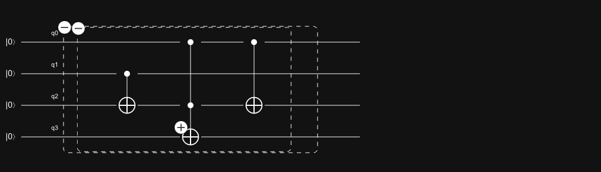
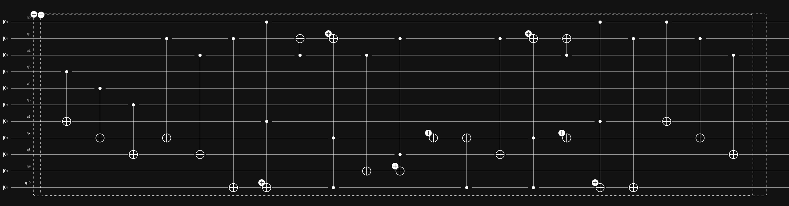

# How do you calculate 1+1 on a quantum computer?

## Uri Levy's question
There's something about being part of a group that's wonderfully transformative. You drink coffee with some people, day in, day out, for a few years, and start speaking a common language. You work with them, commute with them, and walk past them in the halls. And you end up being like them or at least trying to be. 
Working in the Weizmann Institute's (WIS) complex system department was in a very transformative environment. There are many ways in which this place has a language of its own. There's the science, of course. It's the atoms, ions, lasers, magnets, resonators, and nonlinear crystals. It's catching the end of someone's sentence when walking by "...and that's just adiabatic elimination once again!". But there's more to that than just that. It's also about how people reason about the world in general. How they explain themselves and question others. 
Encountering someone who thinks very clearly can be magical. I tried back then, as I do now, to emulate such figures. The school of thought of members of the faculty such as Nir Davidson, Ofer Firstenberg, Roee Ozeri, and others. It's a school whose motto is always trying to distill an idea to its simplest and most condensed form and (usually) doing so kindly. 
Another of these figures is Dr. Uri Levy. A physicist who had roamed those halls as a young student. He then pursued a career in physics in industry, only to return once more as a moth to the flame. Uri has a way of asking questions that is like Socratic dialogue. They are delivered with quiet honesty but tend to find weak spots in the argument, like a stinger missile hitting a Russian tank. 
After leaving WIS's comforts, I started working on quantum computers. Uri was curious and called me one day to ask, "So, I know quantum computers will break cryptography. But how do I even use one to calculate 1+1"? I promised Uri an answer for a while and kept putting it off. The rest of this post, which started with a long-winded (and superfluous) introduction, aims to address this question and to do so in the spirit of the complex systems department. 

## Number types and binary arithmetic

Until the early 20th century, "A Computer" was a person doing the work of calculating things. Today, when we say this word, we mean an electronic device that performs computations using something stored on it **physically**. This information, a list of symbols representing ones and zeros not so dissimilar to lines cut into a clay tablet, can be implemented in many ways. For example, they can be on flexible plastic tape coated by a thin layer of iron. Segments of this layer can then be magnetized, with the magnetic North pointing one way or the other. Manipulating these stored bits of information, done by flipping the direction of the magnetic poles, is how we change what is stored on the tape.

## Counting with cogs

Our brains are great at remembering every lyric of an album we listened to as a teenager. But we're not good at keeping track of too many digits, especially when out of context. Some people can recall Pi to fantastic precision, but that's a feat achieved by specific and targeted practice. A typical person only has a working memory of about 7 digits, but for me personally, it's much less. This is at least part of why children use fingers when learning basic arithmetic. Keeping track of the digits, with their digits (which is why we call them digits, to begin with!).
So external memory is essential when performing arithmetic. Still, to apply a mechanical process to do mathematics for us, we need to add some logic. You can do that in as many ways as your imagination allows, but using machines is an excellent way. 

I've recently visited the Musée des Arts et Métiers (Museum of Arts and Crafts) in Paris. In typical Parisian fashion, it's this beautiful historic building. The spacious and bright exhibition halls include a converted gothic church which, as designed, evoke a gasp as you enter. Instead of a pulpit and religious iconography, a full-size Vulcain rocket engine (the kind used on the Ariane 5 vehicle) is as big as a small bus and at least as prepared to leave this earth as the biblical angel it replaced. 

The museum holds all manner of historic scientific instruments and is well recommended. However, one relic I was particularly interested in is the Pascaline, Pascal's mechanical calculator. 

This machine has a panel with several dials, each inscribed with the digits 0-9. Like when writing a number on paper, each dial position encodes a different decade (units, tens, hundreds, and so on).
This enables you to input a number into the calculator, which is a mechanical memory. Using it frees the user's mind from remembering the first number of your computation. Having input a first number,  the dials are repeatedly turned to input the number to be added or subtracted. The display will then show the result of the computation. Addition can be repeated multiple times to achieve multiplication. By the same token, subtraction can be repeated for division (with remainder). You do need to keep track of the number of times you added or subtracted manually, though (as far as I could tell).

Counting with a dial is nothing fancy. If I set the dial to, say, 2 and then turn it by 2 positions, it will show the value "4". I've successfully performed the computation 2+2=4. However, if the dial was at 9 and I now try to add 2, I will get "clock arithmetic": 2+9=1. This is the result modulo 10, my counting basis. This is not how multi-digit numbers are added, though. We were taught, at a very young age, that we need to "carry the 1". So when we add two digits, and the result is larger than 10 (or whichever number basis you may be working in), you must pass the overflowing digit to the following position to the left.

### Half adder and full adder

A half-adder is a device implementing this behavior, where the overflow digit is passed on (more commonly referred to as "carried over"). A half-adder takes two input numbers and outputs a sum and a carry digit. Two inputs, two outputs. More is needed for a functional adding machine, as you also need a carry-in digit (to check if the previous position has overflowed). A device with this more complex behavior having **three* inputs (two numbers + carry-in) and two outputs (sum and carry-out) is called a full adder. 

In the Pascaline, under the hood, a set of full adders is implemented with cogs. Each cog meshes with the ones before and after it such that a full rotation of the previous cog drags the next one by one position. Doing this smoothly is the heart of the innovation introduced here. 

## Calculating with qubits

### The quantum full adder circuit

It seems that all that remains to be explained is how to make a quantum full-adder. One which can be implemented with atoms, photons, or trapped ions. Here's an example implementation of such a circuit:

This is a quantum circuit diagram. Each line is a quantum register, which in principal, can represent multiple qubits. In this example, each is a single qubit, so we are looking at a 4-qubit circuit. The elements appearing on the lines are quantum logic gates operating on the qubits. There are many kinds of these, but here they are all controlled-not (also called controlled-Z) gates. Their operation is to flip 1 to 0 (and vice versa) if the control qubits are all set to 1. The solid dots are the control qubits, and the open circle with a plus sign is the target qubit. Note there can be multiple control qubits. I could go through the truth table of this circuit, showing this is indeed a full adder whose inputs are q0 and q1 and carry-in and carry-out registers are q2 and q3. Because this post is getting too long as it is,  you can take it as an exercise or take my word for it.

There's one crucial point to remember here. It's a point that has nothing to do with how you compute 1+1 on a quantum computer and everything to do with what a quantum computer actually does. As I have already mentioned, each of the registers appearing on this diagram is a qubit. It's not a bit, taking the values 1 or 0. It can take the superposition value \\(\ket{q} = \alpha\ket{0} + \beta \ket{1} \\) where \\(\alpha, \beta\\) are complex numbers. 

So this is how you would compute the addition of two binary digits encoded onto single qubits on a quantum computer. There are many open questions left. For example: how would you implement a two qubit gate like the ones shown in the circuit representation. But that's a question I would prefer addressing in a separate post. Another question is: what if I want to add together numbers greater than 1 or 0, what then? In such a case, like in any digital computer, you'd need more (qu)bits to represent the number. 

### Classiq and the automated synthesis of quantum circuits

Building quantum circuits to implement some algorithm is a non-trivial task. The simple adder circuit I show above was synthesized using the [Classiq platform](https://platform.classiq.io/). This is all a shameless plug, as [Classiq](https://www.classiq.io/) is the company I work for. But I suppose a personal blog is one big shameless self-promotion anyway, so it makes sense. 

In any case, the idea with algorithmic synthesis is to automate and abstract away some of the work at the level of single qubits, so you can actually do complex tasks.

In fact designing complex quantum circuits will become quite impossible once the qubit number becomes large. As an example, see what the Classiq platform generates for the same simple adder as above, but each input register has three qubits (so it can represent the addition of 7 +7).

The circuits quickly become unwieldy as the number of qubits increase. Requiring some measure of clever automation. 

### Uncomputation and garbage collection

I described how quantum logic gates can be used to create a full adder circuit, but also tried to hint to the fact that's not the whole story. If all you want to do is a single computation that does not feed into the next algorithmic step, there really isn't any more to be said. But that would be a terrible use case for a quantum computer. Unless your arithmetic step is the last one in the quantum circuit, it feeds into other algorithmic building blocks. If that is the case, you will end up with some unavoidable housekeeping to do. 

Suppose we have qubits that are not representing data (the input registers) but help the computation in some way (sometimes known as ancillary or helper qubits). In that case, they can become entangled with the computation. At first thought, so what? The issue is simply ignoring these qubits is like measuring them. If they are entangled with your computation results, that can affect the result you get. I may write a post on uncomputation at some point, but for now, I will just point to the [wiki](https://en.wikipedia.org/wiki/Uncomputation) entry on it. If you know uncomputation is needed, you can extend the circuit and "unwind" the entanglement between ancillary and data qubits. This way, they become independent, and you don't need to care about measuring the ancillae.
Moreover, if you uncompute, those qubits become free again. They can be used as a resource in further work done by the quantum computer. This is another crucial example of what automatic circuit synthesis, as done by the Classiq platform, make quantum algorithm synthesis more tractable.

## Conclusion

Computing 1+1=2 ended up being far less exciting than one may have hoped. There's no quantum magic in this implementation; it's merely a full-adder. Much more can be said, though. We can discuss how quantum logic has to be reversible, unlike classic logic. We can explain how single- and multi-qubit gates' hardware implementation looks in different hardware platforms. We can muse about the intricacies of synthesizing circuits efficiently and comment on when running deep quantum circuits with many operations in sequence will be realistic. But all these things are best kept for another time. 
