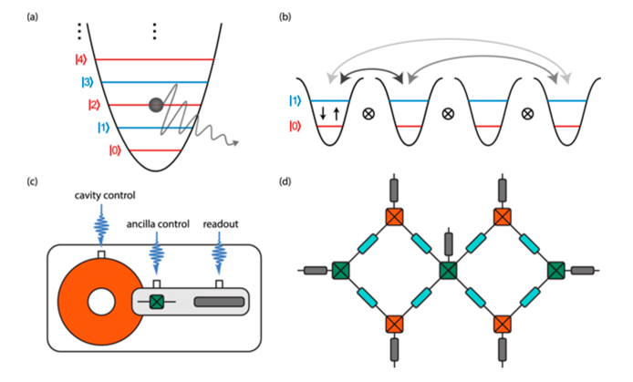
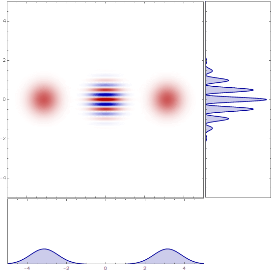

# A very short intro to bosonic codes (Cats) 

This is an informal introduction to Bosonic qubits in circuit QED greatly inspired by: [Atharv Joshi et al 2021 Quantum Sci. Technol. 6 033001](https://iopscience.iop.org/article/10.1088/2058-9565/abe989)

## Bosons 🤡? 
It's not strictly important we understand what bosons are. However, I know that at least for me seeing a funny word I don't know is a distractor when reading something new. I just have to know what the word means. So let's get it out of the way as quickly as possible. 

Quantum particles have _quantum numbers_ associated with them. These numbers are labels. Quantities associated with the particle.
Two examples for such labels are electric charge and spin. Charge is more familiar than spin, but I think most people reading this have good practical intuition on how we typically think of spin: an arrow pointing up or down and "glued" to the particle in some way. What we may not usually think about, if we've not had formal training in this field, is "how much spin" the particle has. This spin vector has a length which for reasons I will not go into (though it's just algebra!) is measured in half-integer quantities. So you can half spin-\\(  ½ \\) particles, spin-1 particles and so on (the units, btw, are multiples of \\( \hbar \\) which is a fundamental constant with units of angular momentum. That's besides the point though).

To avoid repeatedly writing _half-integer_ and _integer_ spin let's give such particles names. **Fermions** are those particles with half-integer spin and **Bosons** are particles with integer spin. It's not immediately apparent why this should be the case, but there's a **huge** difference in the behaviors of fermions and bosons. It comes effect when you have more than one such particle. 

This difference is articulated in something called "spin statistics" and it simply means fermions do not like occupying the same quantum state whereas bosons are quite happy to do so. It is also known, for fermions, as the Fermi exclusion principle. It's incredibly important and is an essential basic principle behind all chemistry and the structure of atoms, molecules and the universe.

Examples of fermions are electrons and protons. Examples of bosons are photons and compound particles, like (sometimes) a whole atomic nucleus. Bosons can also be things which are not particles at a first glance, which is where they come into play in the story of Bosonic codes.

In quantum mechanics particles and waves are interchangeable descriptions. For example, consider the photon. The photon is an "excitation of the electromagnetic field". The way we describe the field is as a (what else) set of couple harmonic oscillators. These oscillators, like a guitar string, have *modes* of vibration, and we can count those. Mode number 1, number 2 and so on. Each mode has more energy than the last. The photon is simply that last excitation, the one with the least energy. The surprising fact is that there is such a thing to begin with! that you can't have half an excitation as you would classically. But this is not important for us, yet again. What is important is how you identify such photon (boson) states. You can choose a basis, the Fock basis, which simply counts what excitation are present in your quantum state. This is a Fock state with n photons:  \\(\ket{n}\\). These are the modes we will be working with when describing boson codes. 

## Resonators 

A resonator is the name we give a device that can maintain an oscillation. An example of a resonator is a transparent glass donut which can have a photon circulating inside. This is called a "Whispering Gallery Mode" resonator, because it's a similar effect to what happens in the [Whispering Gallery of St. Paul's Cathedral in London](https://en.wikipedia.org/wiki/Whispering_gallery). Another, simpler, example is just two mirrors facing each other. This is the effect we get when we share our screen in Slack, and that screen shows the very Slack window to which we are sharing. This back and forth ping-pong "resonates" like an echo. Resonators for electromagnetic waves, sometimes called cavities (like cavities in your teeth), can be designed and manufactures in such a way that the waves lives in them for a very long time before decaying. A good way to say exactly how good a cavity is involves counting the number of full oscillations a wave can undergo before it decays to nothing. In a really good cavity this number can be as high as \\(10^{10}\\) or more. Some resonators are _planar_ meaning they live in the plane where the electromagnetic waves propagate (they are 2 dimensional). Others are 3D cavities and, clearly, extend in a third direction. 3D cavities are bulkier but for some things are better. They are often used in boson code contexts.  

We discussed how cavities are used in reading the quantum state of a superconducting qubit during our first quantum hardware seminars. The idea was we transmit a microwave pulse on a cavity and measure its reflection, both in amplitude and phase. In this current context things are going to be very similar. 

The takeaway message from this section is: photons are bosons, they can exist in a resonator for a long time and there they can be described as occupying a bosonic mode of the cavity. One basis for describing such modes is the Fock basis, which is the photon-number basis. Of course , this is not the only possible basis. 
## Creation and Annihilation Operators

The algebra of how we work with Fock states is simple and elegant. An **operator** acts on a state, possibly changing it to a different state and/or adding a multiplicative (complex) pre-factor. The creation state working on a fock state operates as follows: 

$$ \hat{a}\ket{n} = \sqrt{n}\ket{n-1}$$
$$ \\hat{a}^\dagger\ket{n} = \sqrt{n+1}\ket{n+1}$$

If we combine these, we get the number operator (check for yourself):

$$\hat{n}\ket{n} = \hat{a}^\dagger\hat{a}\ket{n} = n\ket{n}$$

So if you can implement this operator, you can measure how many photons there are in the cavity!

## Kitten code

Now we go on to designing a useful qubit encoding, built from cavity modes. 

Consider the following encoding where the logical qubit is defined in terms of a superposition of (bosonic) Fock states. 

$$ \ket{0_L} = \frac{1}{\sqrt{2}} \( \ket{0} + \ket{4} \) $$
$$ \ket{1_L} = \ket{2} $$

On average, each of these states has the same photon number \\(\hat{n}=2\\). You can check this by calculating the expectation value of the number operator for each basis state. We can also say that these states have even **parity**. They have a +1 eigenvalue when operated upon by the parity operator.

This selection of basis is quite clever for the following reason. What if, for example, we have a single photon lost. This is an error we can easily model with the \\(\hat{a}\\) operator. If we start with a state with even parity \\(\ket{\psi_L} = \alpha \ket{0_L} + \beta \ket{1_L}\\) , what will happen to our stored qubits? 

$$ \hat{a} \ket{\psi_L} = \sqrt{2}(\alpha \ket{0_L} +\beta \ket{1_L}$$

This has a different parity than the data states and is therefore an error. By mapping the error states \\(\ket{1}\\) and \\(\ket{3}\\) back to our logical qubits we can retrieve the original data. So we can recover from the error. 

You will be within your full rights at this point to demand I explain several things. A few of these are: 

1. How do you measure the parity operator? 
2. How do you measure photon number? 
3. How do you measure the \\(\ket{1}\\)) and \\(\ket{3}\\)) parts separately to retrieve the data?   
4. Is the data lost upon correction? 

And many more. But I will not answer these questions here and we can all ask them together during the upcoming seminar featuring Dr. Jérémie Guillaud from Alice&Bob. 

However, there is a very nice piece of motivation on why anyone should care about a kitten code. An alternative way to encode information such that we are able to correct for single qubit flips is the four qubit code. In such a code there are four physical qubits, 3 ancillary qubits and a considerable amount of supporting hardware. This includes couplers, readout resonators and wires. This is shown on the right hand side of the diagram below. 

Compare this to the left hand side of the diagram where there are two cavities and one qubit (transmon), all enabling the same level of error protection. neat.

Why is the transmon there, you may also ask, we only discussed the cavities. Well, here as well, I'm going to ask you to be patient and wait for the special talk. 

## Cat codes : A rotation symmetric code

The kitten code is a code designed to correct photon loss. However, there are other kinds of error in the world. Ideally, you'd like to also correct for multiple photon loss as well as dephasing errors if possible. Cat codes are one example of a bosonic qubit, but unlike the kitten code above, it is not made of Fock states. Instead, the cat code is constructed from coherent states. 

### Coherent states

Coherent states are "the most classical" of quantum states. When people say this, they mean the following. Take a coherent state \\(\alpha\\)) and put it off-center in a quadratic potential. The evolution of the center of mass of this state in the potential (how it oscillates in the potential) will be exactly like that of a ball moving in the potential well. So in a way it does not look quantum. 

Another way to describe a coherent state is: the state that is an eigenstate of the annihilation operator.

$$\hat{a}\ket{\alpha}=\alpha\ket{\alpha}$$

If you want to write the coherent state in the basis of Fock states, you can do that of course. They are just two sets of orthogonal base states. You do need an infinite series though: 

$$ \ket{\alpha} = e^{-|\alpha|^2/2} \sum \frac{\alpha^n}{\sqrt{n!}}\ket{n}$$

If you look closely, you can see this is the sum over a poisson distribution of the photon number. Deep.

### Back to cat qubits

So instead of being constructed from Fock states, Cat-codes are constructed from coherent states. For example as:

$$ \ket{\alpha} \pm \ket{-\alpha}$$

This is where the cat name comes from. We make a state with something (the coherent state) and something orthogonal to it, like the cat that is both dead and alive. 

## One last thing: Wigner distributions
If you go to the Wikipedia page on [cat states](https://en.wikipedia.org/wiki/Cat_state) you will see something quite mesmerising. I stole it and put it down below:  

You could watch this for hours in full procrastination glory. But... What is it? 
It's a Wigner distribution (Who?) which is a quasi-probability distribution (What?). I will now oversimplify, but I think it's a good first pass on the topic. The W function takes complex valued function pairs, like position and momentum of a quantum particle, and maps those onto a real valued function. This way you can plot the state of the system and visualized its evolution. You can also observe phenomena such as interference, which you can see as fringes (oscillations) in the gif. This concept closely relates to the concept of phase space you may know from classical mechanics and electrical engineering. 

Wigner functions and other related function are used in quantum optics and quantum information, and are especially popular with folks doing bosonic codes. 

## Conclusion

- Cat codes are encoding of logical qubits onto the states of an electromagnetic cavity. 
- These encodings are designed to be robust against certain kinds of errors. 
- The use of bosonic modes can enable the simplification of the QPU and improve scalability.
- The system still uses transmons or other superconducting qubit architectures, but there are less of them and we didn't explain what they are there for.
- Another thing I did not say: we are in, or at least near, the realm of [continuous variable quantum computing](https://en.wikipedia.org/wiki/Continuous-variable_quantum_information). Just in case you want some extra nighttime reading.

Hope to see you all in Thursday's talk!

