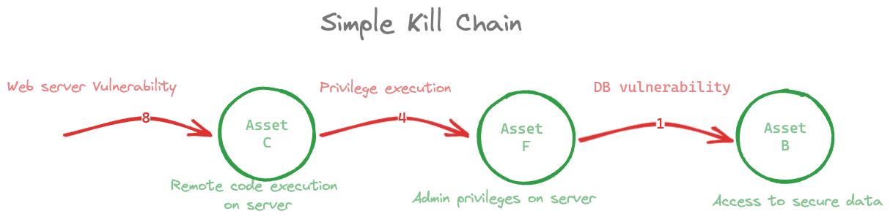

This post was [originally posted](https://www.classiq.io/insights/kill-chains-the-internet-of-things-and-quantum-combinatorial-optimization-a-buzzword-salad) on the Classiq blog.

Depending on who you ask, the size of the cyber security market is currently (as of August 2023) estimated at a few hundred billion USD/year. It’s harder to estimate the size of the internet-of-things market as the definitions are more vague than those of cyber-security. Is a web-connected-toaster an Internet-Of-Things  (IOT) device? Sure, maybe, but what about a Radio-Frequency (RF) identification tag with a microchip embedded stuck on an egg carton? Yeah, that’s probably IoT-related too. Coincidentally, both examples can be targets for cyber-attacks. However, it’s unclear which evil cyber-capable red-tailed fox will likely target that lowly yet delicious, internet-connected treat.

Whatever the exact market size, both markets are unarguably huge and lucrative. The quantum computing market, though consummately precocious, is still much smaller. Let's amicably estimate its size to be about 1% (or less) of that of the cyber market at about 1B USD/year.  Nevertheless, the growth projections are staggering.

Some of the projected growth results from how quantum computation capabilities are enablers of other markets. In particular, in today’s post, we will discuss how using quantum algorithms for combinatorial optimization, which can potentially outperform their classical counterparts, is useful in the industries of our exposition: IOT and Cybersecurity. 

# A patch a day keeps attackers at bay.

What is *cybersecurity*, then? It’s the art and craft of preventing malicious actors from gaining access to things you’d rather they don’t have access to—your data, your computers, and your toaster. The tricky thing is that we don’t often have disconnected computer systems these days. Everything is meshed via a network, essentially a large collection of interconnected assets. 

Each asset on a network either **is** software or **has** software associated with it. A sensitive database contains information you want to keep to yourself and runs on a specific database vendor and version. An oversight in the design of the network layer of some operating system has left a gaping hole someone can exploit to turn your computer into a distribution node for unauthorized Harry Potter fan fiction; the list goes on. 

As with most complex systems, computer systems will always inadvertently allow for use not intended by their original designer. Luckily, for computers, we can deploy patches closing any known holes. Correctly patching assets on a network is one of the most critical factors for a healthy cyber-secure network. It turns out that’s not a trivial task. 

There are many difficulties in hermetically sealing all known issues using patches. First and foremost, the sheer number that needs to be tracked and applied is overwhelming. Below is the number of published and known issues collected on CVE, the online vulnerability register. The trend of increasing threat is clear, and the number is well in the tens of thousands. The fact that patching also needs to consider compatibility issues, can affect system performance, and has to be coordinated across a heterogeneous network makes it clear this is a challenging challenge to overcome.

# Just the right patch in all the right places.

Physicist Eugen Wigner once commented that mathematics is “unreasonably effective” in the natural sciences. In layperson’s terms, It’s a pretty good idea to make a mathematical model if you want to solve a problem. So here, too, we probably should. The model presented here follows this [original work](https://arxiv.org/abs/2211.13740) and is a graph-theoretic model. We begin with some definitions.  

* We work with a **graph** linking assets and vulnerabilities. 
* An **asset** is an item that has value for an attacker—for example, data stored in the system. The availability, consistency, and integrity of assets are to be preserved.
* A **vulnerability** is a flaw by which an attacker can exploit an asset. e.g., an incorrectly patched piece of software, weak password, poor network configuration, etc. 

A connection between an asset and a vulnerability means that the asset is susceptible to it. This computer has a silly password, that computer is running stock Windows XP from 20 years ago, and so on. Such links mean there are known ways to get access to that computer. Ways like guessing a password is “Password” (Which, inexplicably, is still a very [probable guess](https://en.wikipedia.org/wiki/List_of_the_most_common_passwords)).

The danger of having affected assets is that such “chain links” can be attached together. So, when combined, multiple and seemingly unrelated insecure links allow an attacker to move laterally through the network. The attacker can then establish a complete attack scenario for targeting their desired critical asset. Such a set of moves is illustrated in the image below. Though it sounds like the name of a particularly bad (particularly good?) Steven Segal film from 1998, stringing vulnerabilities together, is called a Kill Chain.  

## Expensive things and where to put them

We still want to patch a network. We really do. But we need to take a slight detour where we explain an essential mathematical concept and hint at how it may be used to secure an Internet Of Things application. 

An example of an IOT scenario is where a large collection of communicating sensors is used. Wireless Sensor Networks (WSNs), as they are called, can be deployed when protecting a forest from wildfires (if deploying sensors sensitive to various environmental factors like humidity, temperature, and air pressure), monitoring industrial applications where many machines work in unison, for coordinating transport networks and in many more settings. The diagram from [1] below shows an 11-node WSN. Node number 1 is marked differently from the others as it controls the network and centrally collects information from it.  

[1] Yigit Y, Dagdeviren O and Challenger M 2022 Self-Stabilizing Capacitated Vertex Cover Algorithms for Internet-of-Things-Enabled Wireless Sensor Networks Sensors 22 3774 Online: http://dx.doi.org/10.3390/s22103774

A WSN, like any other computer network, can be a target for attack. Maybe I own an ice cream factory, and my competition really wants to know at what temperature I make my mint-chocolate-chip. So, how would one protect their network? 

Some network nodes can be more intelligent than others. They can have monitoring capabilities allowing them to, for example, inspect the contents of information passed along the network (network packets) and create alerts if packets appear malicious. This type of application is called a Link-Monitoring scenario. 

It’s not feasible to make all nodes of the WSN monitoring nodes. That would be an expensive solution in terms of actual cost per node and energy consumption. Imagine, for example, that your nodes are spread across a vast forest and run on battery power. In such a case, you may need to occasionally change batteries. Deploying energy-conserving nodes would make your life much easier. Making every node smart, power hungry, and expensive is not the way to go. 

We now want to ask which nodes in our network “see” the most other nodes. The diagram below, also taken from [1], shows a selection of monitoring nodes indicated by a red color. 

In graph theory, the selection of nodes that can “see” (i.e., are connected to) as much as possible of the entire graph is called the **Maximum Vertex Cover** ([MVC]([https://en.wikipedia.org/wiki/Vertex_cover])) of the graph.

Finding the MVC is not an easy computational task. It’s a problem that is technically classified as NP-hard. Such problems have solutions that are easy to verify (easy means you can check if a solution holds relatively quickly, at “polynomial time”) but is hard to find (meaning there aren’t any quick - “polynomial time” - solutions). 

Enter quantum computation. We can find an approximate solution to the MVC problem using a quantum algorithm! 

# Applying the quantum patch

Let’s hop back to the original problem we were chewing at: patch management. Our goal was to identify which patches we should apply to our computer network to destroy the most kill chains. 

Mathematical graphs are data structures that quantum algorithms tend to like. There are algorithms for splitting graphs apart, ones for searching through them, and so on. 

The graph we use to represent our predicament is technically known as a bipartite graph. That means it is a collection of nodes of two distinct types (assets and vulnerabilities) which are connected by edges. An edge represents the ability of an attacker to move from one asset to another by exploiting vulnerabilities available on that asset. 

Let’s represent the kill chain we showed above as a bipartite graph. The numbers 1,4,8 represent specific vulnerabilities, they don’t mean anything in particular. Just imagine it’s a specific vulnerability from a list of known ones. 

We’d like to eliminate all vulnerability-to-asset edges from this graph, which is like saying we want to apply all patches to all assets and make everything 100% secure. But we can’t. So we need to find a strategy to prioritize vulnerabilities such that the kill chain is broken. In this simple example, eliminating vulnerability 4 breaks the kill chain. 

We can introduce a method to see this. It may seem odd to further modify the graph for this simple example, but it will prove useful later in more complex scenarios. Let’s define the dual graph. 

The Dual Graph looks at vulnerabilities and connects them **directly** if they are connected via an asset in the “original” graph. Here’s the dual graph for our example: 

Our intuition from before that removing vulnerability four will break the chain is now more palpable, and it will not be possible to move from 1 to 8.

# What if we have a more complex graph? 

Consider now a more involved example with more assets and more vulnerabilities. It’s still just a toy model compared to a real network with hundreds of thousands of nodes, but it’s already getting visually complicated. 

Converting this to its dual graph produces the following: 

As a simplification, we built an undirected graph. This can be justified as we want to break the chain regardless of the direction and prioritize the most well-connected vulnerabilities. Also, it makes our lives easier, and it’s often better to start simple and progressively introduce complexity. Things are hard as it is. 

Looking at this graph, which nodes will be removed to break the most kill chains is not apparent. So what do we do? Find the MVC, of course!

The MVC of the dual graph tells us which patches we need to apply to disconnect the most unpatched nodes from each other, thus preventing vulnerability sequence. In other words, breaking kill chains. 

In this case, the nodes marked in blue show the MVC solution. One should apply these patches to get the best protection for the minimum cost. 

This solution can be converted back to its form as a bipartite graph, showing a much simpler form than what we have before. Crucially, moving from one vulnerability to another via assets is impossible. The chains are broken!

MVC and quantum: The Classiq way

We now have a mathematically formulated way to tackle cybersecurity problems. In the link monitoring example and for kill chains, the key is finding the MVC. Easy.
As we already mentioned, the problem is that finding the MVC is NP-hard. Because a real enterprise network can have 100,000 hosts or more, this is typically an intractable problem.   

Finding an approximate maximum vertex cover can be done on a quantum computer in sub-exponential time using a quantum algorithm, a workhorse of a class of combinatorial optimization problems tackled by quantum computing: QAOA.

MVC is a typical example of a combinatorial optimization problem. The difficulty arises from the sheer number of combinations of items; there are typically some constraints that need to be met when selecting a particular combination, and there isn’t sufficient structure in the problem to be smart about how you make a selection. You end up having to check every possibility and find the one that works. In other words, finding a solution will cost an exponential amount of time in the size of the problem.

QAOA allows you to be faster than that, or sub-exponential, at least if you are willing to find an approximation rather than an exact solution. We will not explain QAOA in-depth, though if the crowd wishes (hit us on the [Classiq slack server](https://join.slack.com/t/classiq-community/shared_invite/zt-1z8atdhpy-IZcBVLy~2juQQ8ioqa_BTg)) we may do it in the future. You can read many reviews online, e.g [here](https://arxiv.org/abs/2306.09198).

Tackling combinatorial optimization problems with QAOA is one of the strong suites of the Classiq platform. There are three simple we need to take here: 

1. Define the quantum model using Classiq’s combinatorial optimization capabilities.
2. Use the Classiq engine to generate a parameterized quantum circuit 
3. Execute the circuit within the Classiq platform to obtain the optimal parameters representing the solution.

The technique of building Classiq models involving QAOA and graphs is quite natural, as it is compatible with standard and open-source tooling. When using the Classiq Python SDK, a network graph is first built with the networkx library.  The next step is to define the optimization problem. There are different optimization languages in existence. One general purpose and expressive way to do this in the Python ecosystem is to use the [PyOmo language in Python](http://www.pyomo.org/). PyOmo is powerful and rich, and it allows users to express a large number of optimization models. Uniquely, PyOmo is tightly integrated with the [Classiq model](https://docs.classiq.io/latest/tutorials/advanced/optimization/).  

The following image shows a circuit synthesized by the Classiq platform, finding an approximate MVC for a simple dual network. This circuit can be easily run on real quantum hardware or simulators from the Classiq platform at the click of a button.  

# Conclusion 

Cybersecurity presents countless not-trivial problems that have the potential to wreak havoc on computer networks and cause costly or dangerous disruptions. Some of these challenges can be formulated mathematically and tackled with computational tools. 

The size of modern computer networks, which we depend upon in our daily lives, can be immense, making solving some of the computational problems in cybersecurity impossible with normal computational resources. 

Luckily, there are tools in quantum computations that make finding solutions possible, but it may be more practical to generate quantum software to search for these solutions. 

The Classiq platform presents the best and easiest way to apply state-of-the-art quantum algorithms to real-world problems using the standard tools that are used in optimization problems, like the PyOmo language. 

