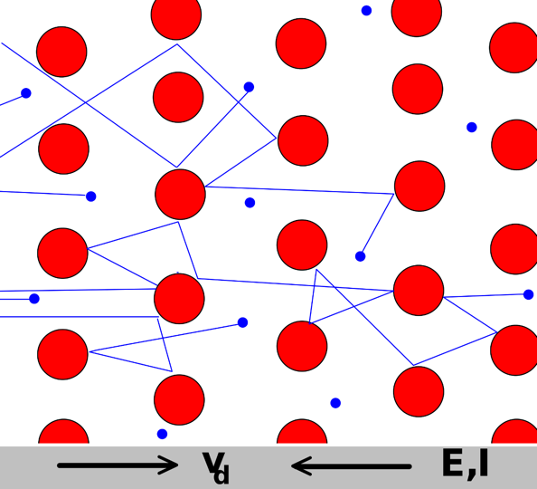
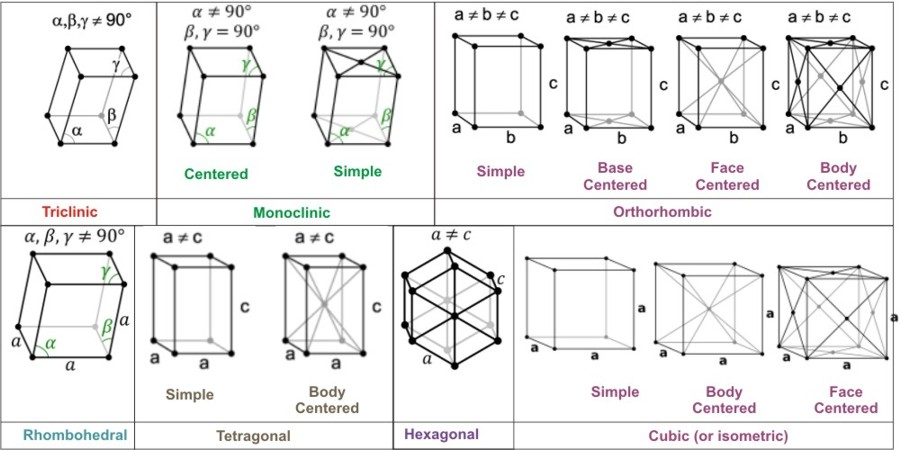

## So many qubits, so little time 

At the time of writing this there are at least five competing technologies vying for the quantum computing throne. Superconducting qubits, trapped ions, neutral atom arrays and silicon (CMOS) qubits are the top contenders. The various so-called "color centers", a prominent example of which are Nitrogen-Vacancy centers in diamonds, arguably lagging behind. 

 Using an eye-rollingly terrible expression, it's 'The Zoo of Qubits' 🙄. They only reason I am willing to use it is because I do believe some of them are cute but useless, some are scary and may bite you, and It's very likely most of them will be extinct soon.

Here I will give a brief introduction to what quantum dot qubits are. Although not currently as advanced as trapped ions and superconducting qubits, the supposed incumbent and leading contender for the qubit crown, they may well overtake them as they stand on some of the most solid of foundations. 

## Solid state physics

To start speaking about quantum dots, we must choose our own adventure. We can go left, deciding we don't care (or we already know) about how to control the motion and orientation of electrons in semiconductors. That's a much shorter path, but you will miss out on some intricate, albeit fun, physics. On the other hand we may decide to dive into the entirety of solid state physics, starting at page 1 of [Ashcroft & Mermin](https://www.amazon.com/Solid-State-Physics-Neil-Ashcroft/dp/0030839939) and spiralling to a 5-piece series that will be read by no-one and will benefit even fewer people. Here, I'll try to guide us through the long route, but doing it like an elite tour-de-france cyclist on a magnificent alpine road (Yeah, I've been watching the [Netflix show about the Tour]() this weekend). Meaning: we'll do it as quickly as possible and not pause to take in the views. Just the bare-minimum, as I perceive it. It won't be a five piece series, I will do my best to complete is in just two.

## The flow of electrons in a periodic forest

### The classical picture

In quantum mechanics we think of particles as waves sometimes. A wave, unlike a traditional billiard-ball particle, doesn't have **a** position. Is the wave here? Is it somewhere? It's an _extended_ entity. It has different wave amplitudes at different positions and if you look at more than one wave arriving at the same position, they act as the sum of their individual amplitudes. Quantum mechanics tells us the probability of finding the particle (or particles) at a specific location is given by that amplitude squared. All this is fairly straight forward. 

Our goal here is to get some intuition for how electricity flows through a medium. There's a simple but totally useful model for this called The Drude model after the 19th century German physicist Karl Drude. Here's the model: electricity is the flow of electrons which we imagine to be billiard balls hopping about in a forest of immovable pillars.

The electrons are the blue circles, and they are moving between large red circles which are immovable. The electrons are mobile, and are of course electrically charged. This means that if we apply a uniform electrical field (for example by connecting a battery across the opposite sides of the white slab) then they will start moving. In the image above, this is marked as their "drift velocity" \\(v_d\\) which points to the right. Because the electrons have _negative_ charge you can see the electric field direction \\(E\\) and the electrical current \\(I\\) are actually pointing against the direction of the drift velocity. This is what we call "conventional current" which was chosen such that the direction of the current is out of the battery positive terminal and into the battery negative terminal. In retrospect, it's backwards, but we're stuck with it. 

What we get is moving particles that have some probability of colliding with an immovable ion and bouncing off of it, elastically. When they do, their velocity changes, but as they are continuously acted on by the force due to the electrical field they will eventually keep on trucking towards the positive battery terminal. Because this process has a stochastic (random) nature to it, it becomes most comfortable to start asking questions about things like the average momentum of the electrons.  

This is a very simple idea, but it already contains a fair bit. For example, we can very easily extract Ohm's law from here. See the [wiki article](https://en.wikipedia.org/wiki/Drude_model) if you're interested. A lot more can be done with this simple starting point. That's always the hallmark of a nice scientific theory. However, we can experimentally show Drude alone cannot be the complete description of how electrons behave. 

### Why do we need quantum electrons?

How do we know the Drude model can't be the whole story? Well one good clue is that when you cool some metals down their resistance to the flow of electricity becomes exactly **Zero**. Not close to zero, not "very small", it becomes non-existent. How can that be, if we are thinking of Drude's immovable ions? Well, it can't be. Unless something very fishy is happening, for example of all electrons magically align in a neat line which just happens to miss every single ion, there will be some chance of hitting an ion. And yet, the electrical resistance disappears. 

We've known about this behavior for a fairly long time. The ability to cool thing to cryogenic (anything below 0 °C is technically cryogenic) temperatures dates back to the 19th century. Oxygen, which becomes liquid at -180 °C, was first liquefied in 1877. Liquefaction of Helium, which occurs at -269 °C, was first achieved in 1908 by the Dutch physicist Heike Kamerlingh Onnes. He then used this ability to measure the electrical resistivity of metals at cold temperatures and discovered that the resistivity of Mercury (the element Hg) disappears when placed in a bath of liquid helium. 

There are other bits of experimental evidence that tell you the Drude model is incomplete. With modern eyes it shouldn't be surprising, for example, that to give a more complete description of electronic motion we would like to include the wave nature of the electron.  The fact electrons have spin as well as electrical charge should be accounted for, and we may want to bring more detail into the model to account for things like vibrations of the ions (though that isn't a correction due to quantum theory and can be just slapped onto the Drude model with relative ease). 

### What is a Solid? 

To move forward we need to pause for a moment and think about something quite basic. What's a solid? What makes the "solid" in "solid state physics"? You can think of one of its high school definitions. A solid is the state of matter of an object which "opposes shear forces". That means that if you can glue something to the ground and push it from the side, and that thing then tries to push back then *it is a solid*. Water can't do that. Neither can Jell-O. That's a fair description, but it doesn't tell us anything about what a solid is *microscopically*? How does a solid look like at the atomic scale? 

The way we learn to think about solids as physicists in our undergraduate training is as _Crystals_ 💎. A crystal in this context means a periodic tiling of atoms. Crystallography is really rich and interesting and there's tons to be said about it from physics-theoretical, mathematical and experimental points of view. It is a large body of work that has been explored for over a century but is ever evolving. 

In the 1980s it was considered as a fundamental truth that crystals must be absolutely periodic and obey certain rotational symmetry properties. The idea was that a solid is an object where atoms (maybe of more than one variety) are placed on a grid in space. That grid can look like a chess board, it can look like a honey-comb or have some other repeating pattern in two or three dimensions.

This is a collection [(source)](https://www.toppr.com/guides/chemistry/the-solid-state/space-lattice-or-crystal-lattice-and-unit-cell/) of possible periodic tilings of atoms, shown as a single "unit-cell" which is replicated repeatedly to build the solid (crystal). 

The rotational symmetry rule means you can take a unit cell, perform a rotation at some angle about some axis and get the exact same cell. It was thought to be a necessary condition for any valid solid structure, but it was then shown by experimentalist Dan Shechtman of the Technion in Israel that was not the case. This was a discovery for which he was awarded the Nobel Prize in Chemistry in 2011. I told you this story because it's cool, but mostly because I wanted to get across the point that crystallography is rich and interesting. 

### Electron waves in solids

We've established (I hope) the picture of electrons in a solid is not that of billiard balls and immovable posts. What I do want us to think about next is the model where electrons are waves flowing through a periodic set of barriers. When electrons, described as waves, flow through periodic obstructions something magical happens. 

Consider a wave-breaker offshore in your favorite beach. Those long piles of big rocks placed in the water to protect the beach from most of the waves. The image below was taken at my beloved local beach in Herzeliya. 

Look at those waves going through the gap between adjacent breakers. There's a set of circular wave-fronts expanding towards the beach. What is less apparent in the image is that there are also reflections. From the waves that came in behind the wave breaker, there was a part that went through and a part that was reflected back. The waves coming in, the waves coming through and the waves reflecting back all add together to create the patter we see on the surface of the water. 

In the unusual case where there is not a single wave breaker, but many of them, and they are all placed in a periodic array, interesting patterns start to emerge.  The shape of the disturbance start becoming periodic itself. This is called the *Bloch Theorem*. Electron wave propagating obey this theorem and are referred to as Bloch Electrons. The details are intricate and crucial to making calculations, but we only wanted a whirlwind tour. So what's the take home message here?  

The key is that because of the dance of electron waves and ions in the solid, the wave function of the electrons is periodic. A periodic wave function behaves, qualitatively, like guitar strings and other systems that exhibit vibrations. Harmonic oscillators, drum faces and so on. Vibrations are very useful in physics and this vibrational quality is going to be key for building qubits, but for now we will leave it at that. 

### Manufactured solids

Today, because we are able to control single atoms, and single atomic layers, we have access to artificial (manufactured) crystal structures. An example of this is the one-atomic-layer thick sheet of carbon atoms called Graphene. This material and its properties have been actively explored since the 1990s, and also produced Nobel Prize laureates like Andre Geim and Konstantin Novoselov. More recently, the ability to stack such monolayers and even to change the angle between them as they are stacked (so-called "magic angle graphene") has produced even more rich physics (see for example pioneering work by [Pablo Jarillo-Herrero at MIT](https://physics.mit.edu/faculty/pablo-jarillo-herrero/)). This is exceptionally exciting stuff and I think I'll try and write a post about this topic at some point.

With manufactured solids we can control our periodic Bloch electrons in more ways. For example, we can make layers of different materials, like a layered cake. This makes the periodicity that the electrons "see" above and below them is different to what they see to their sides. Such a situation can make it "easier" in some sense for the electrons to flow within a layer than between layers. They end up flowing only in two dimensions and not in the third dimension. This is a useful situation called 2DEG, Two-Dimensional Electron Gas. There are other possibilities for controlling electrons that come about by being able to control the geometry and materials in the manufactured solid.  

On the next post I'll explain how these knobs we have to control electrons enable the creation of devices where Quantum Information is manipulated. I will also try to explain why such devices hold great promise for achieving the scale needed for truly useful quantum computation. 

